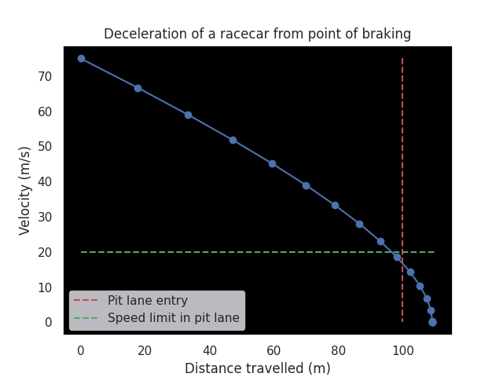

# Modelling Initial Value Problems in Python

## Contents

- [Introduction](#introduction)
- [What are Initial Value Problems (IVP)?](#what-are-initial-value-problems-ivp)
- [Modelling ODEs](#modelling-odes)
- [SciPy's solve_ivp](#scipys-solve_ivp)
- [Visualization with Matplotlib](#visualization-with-matplotlib)
- [Author](#author)

## Introduction

This is a brief overview of modelling simple initial value problems in Python. Here, we will look into the mathematical concepts and the Python libraries involved. Therefore, a basic understanding of differential equations and programming (Python preferred), would be extremely helpful before diving into the guidelines that follow.

## What are Initial Value Problems (IVP)?

Before getting to Initial Value Problems, we describe Ordinary Differential Equations (ODE). An ODE involves unknowns of one(or more) functions of one variable along with its derivatives. A simple example would be:

<code>y' = 6x - 3</code>

where y' is the first derivative of the function y w.r.t. x. The solution to an ODE is not a numerical value but a set of functions. For the above example, the set of infinite solutions would be:

<code>y = 6x2/2 - 3x + c</code>

where c is a constant. One can differentiate the above expression or integrate the ODE to verify.

An Initial Value Problem (IVP), is just an ODE with an initial condition, providing the value of the function at some point in the domain. This allows us to achieve a finite set of solutions for the ODE.

For instance, if we were given values y=4 at x=0 for the above ODE, we can substitute their values in the solution expression to get c = 4 and thus, to a single solution.

## Modelling ODEs

ODEs are used to model various practical scenarios. Here, we present an instance in the simplest of terms. These events are more complex in reality and require much more detail. 

We take an instance from motorsport of a racecar braking before entering the pit lane. When entering the pit lane, a racecar needs to lower its speed under a designated limit before the entry line. Our aim here would be to predict if a racecar can stay under the regulations for any given speed and distance remaining after braking.

First of the variables, we need to consider is the distance 's' from the entry line. The change of 's' over some interval of time, which is the derivative of 's' w.r.t. time, is the velocity.

<code>v = s'</code>

Similarly, acceleration is the change in velocity over a certain period.

<code>a = v' a = s''</code>

We can update distance by the velocity, but we still need to determine how the acceleration will vary through the braking period to update the velocity accordingly.

We will consider the deceleration of the racecar to be incurred by a combination of the 'bkf', the braking force of the car, and 'dgf', the drag which is dependent on the velocity. The forces are negative as they act in the opposite direction.

<code>a = -bkf - dgf*v</code>

## SciPy's solve_ivp

Moving onto the programming part, we discuss SciPy's 'solve_ivp' function. Ensure that you [install the SciPy library](https://scipy.org/install/) in your system before importing the 'solve_ivp' function as follows.

    from scipy.integrate import solve_ivp        

Looking at the [documentation for 'solve_ivp'](https://docs.scipy.org/doc/scipy/reference/generated/scipy.integrate.solve_ivp.html), the most important parameter it requires is the function to update the variables we are interested in. The 'updater' function below computes the changes in distance and velocity as we modeled before.

    # variable update function
    def updater(t, y):

      bkf = 12 # brakes
      dwf = 0.3 # drag
      
      # variable values for current iteration
      s, v = y
      
      # computing change in variables for current iteration
      dsdt = v
      dvdt = (-1)*(bkf + dgf*v) if v > 0 else 0

      return dsdt, dvdt

The functional argument should have the first parameter as the independent variable, which is time in our case. The second parameter is an n-dimensional list containing the current state of all the dependent variables, which are distance and velocity in our case.

The function should return a list of the same dimension as the second parameter representing the changes in the input variables w.r.t. the independent parameter in respective order.

Other required parameters for 'solve_ivp' include 't_span' & 't_eval' which take in the bounds and specific values for computation for the independent variable.

    # time bounds for 't_span'
    start, end = 0, 5
    # time step
    dt = 0.25
    # list of desired time values for 't_eval' 
    times = np.arange(start, end + dt, dt)

'y0' is another required parameter that takes in initial values for our dependent variables.

    # initial values for distance & velocity
    s0 = 0
    v0 = 75
    ivs = [s0, v0]

Finally, 'solve_ivp' is called. The attribute 'y' from the return object provides the required solution lists in the input order, whereas attribute 't' gives you back the inputs provided for 't_eval'.

    vals = solve_ivp(fun=updater, t_span=(start, end), y0=ivs, t_eval=times)
    # gives you the list of values for the dependent variables
    s, v = vals.y
    # list of values for independent variable
    t = vals.t

## Visualization with Matplotlib

We make use of the [Matplotlib](https://matplotlib.org/) library for visualizing our models for simplicity. The visualization we are interested in is between the distance and the velocity.

In addition to plotting 'v' vs. 's', we plot two lines indicating the distance to the pit entry line for the race car, and the velocity it should be under by that point.

    # plot v vs. s
    fig, axs = plt.subplots()
    axs.grid(False)
    axs.set_facecolor('black')
    axs.plot(s, v, 'bo-')

    # lines representing pit entry line and speed limit
    axs.plot([100, 100], [v[0], v[-1]], 'r--', label='Pit lane entry')
    axs.plot([0, max(s[-1], pl_dist + 10)], [20, 20], 'g--', label='Speed limit in pit lane')

    axs.set_xlabel('Distance travelled (m)')
    axs.set_ylabel('Velocity (m/s)')
    axs.set_title('Deceleration of a racecar from point of braking')
    plt.legend()
    plt.show()

Our initial values here for the velocity at the time of braking, the distance from the pit entry line, and the speed limit are 75 m/s, 100 m, and 20 m/s respectively. From the graph, we can conclude, the racecar driver will just be able to slow the car down under the speed limit before entering the pit lane.

Sticking to motorsport, one follow-up could be to model lap time degradation, which is crucial for a team to decide when to stop for a tyre change for the optimal race strategy.

## Author

[Sanjiv Pradhanang](https://github.com/spradha1)